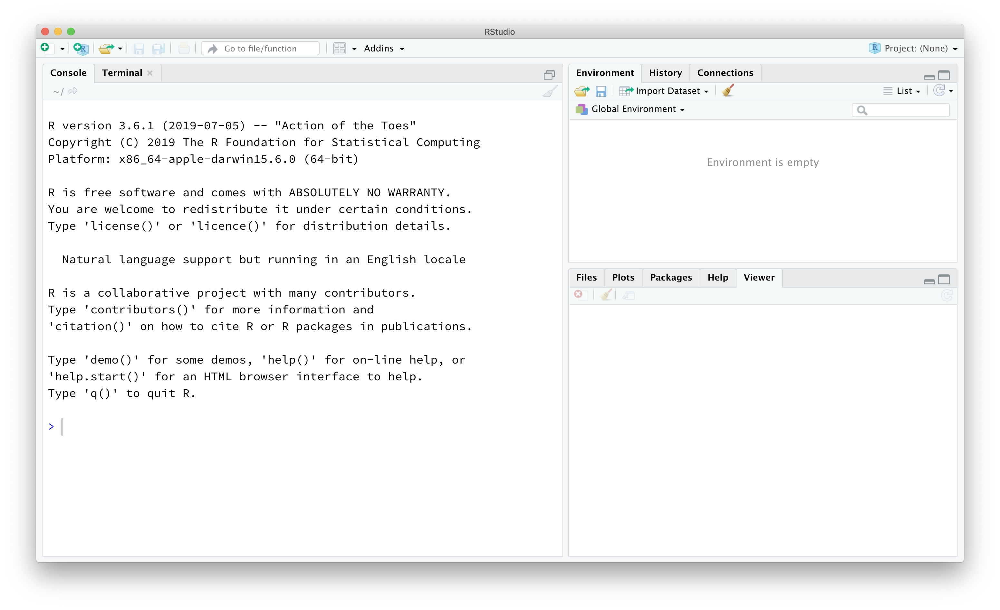

```{r global_options, include = FALSE}
knitr::opts_chunk$set(eval = TRUE, results = FALSE)
library(tidyverse)
library(openintro)
```

## The RStudio Interface

The goal of this lab is to introduce you to R and RStudio, which you'll be using throughout the course both to learn the statistical concepts discussed in the course and to analyze real data and come to informed conclusions. To clarify which is which: `R` is the name of the programming language itself and RStudio is a convenient interface for working with `R` .

As the labs progress, you are encouraged to explore beyond what the labs dictate; a willingness to experiment will make you a much better programmer! Before we get to that stage, however, you need to build some basic fluency in `R`. First, we will explore the fundamental building blocks of `R` and RStudio: the RStudio interface, reading in data, and basic commands for working with data in `R`.

Go ahead and launch RStudio. You should see a window that looks like the image shown below.

```{r r-interface-2020, echo=FALSE, results="asis"}

```

The panel on the lower left is where the action happens. This panel is called the *console*. Every time you launch RStudio, it will have the same text at the top of the console telling you the version of R that you're running. Below that information is the *prompt*, indicated by the `>` symbol. As its name suggests, this prompt is really a request: a request for a command. Initially, interacting with `R` is all about typing commands and interpreting the output. These commands and their syntax have evolved over decades (literally) and now provide what many users feel is a fairly natural way to access data and organize, describe, and invoke statistical computations.

The panel in the upper right contains your *environment* as well as a history of the commands that you've previously entered.

The panel in the lower right contains tabs for browse the *files* in your project folder, access *help* files for `R` functions, install and manage `R` *packages*, and inspecting visualizations. By default, all data visualizations you make will appear directly below the code you used to create them. If you would rather your plots appear in the *plots* tab, you will need to change your global options.

### R Packages

`R` is an open-source programming language, meaning that users can contribute packages that make our lives easier, and we can use them for free. For this lab, and many others in the future, we will use the following:

-   The **tidyverse** "umbrella" package which houses a suite of many different `R` packages: for data wrangling and data visualization
-   The **openintro** `R` package: for data and custom functions with the OpenIntro resources

In the lower right hand corner click on the *Packages* tab. Type the name of each of these packages (tidyverse, openintro) into the search box to see if they have been installed. If these packages do not appear when you type in their name, install them by copying and pasting or typing the following two lines of code into the console of your RStudio session. Be sure to press enter/return after each line of code.

```{r install-packages, message = FALSE, eval = FALSE}
install.packages("tidyverse")
install.packages("openintro")
```

After pressing enter/return, a stream of text will begin, communicating the process `R` is going through to install the package from the location you selected when you installed `R`. If you were not prompted to select a server for downloading packages when you installed `R`, RStudio may prompt you to select a server from which to download; any of them will work.

You only need to *install* packages once, but you need to *load* them each time you relaunch RStudio. We load packages with the `library` function. Copy and paste or type the the following two lines in your console to load the tidyverse and openintro packages into your working environment.

```{r load-packages, message = FALSE}
library(tidyverse)
library(openintro)
```

We are choosing to use the tidyverse package because it consists of a set of packages necessary for different aspects of working with data, anything from loading data to wrangling data to visualizing data to analyzing data. Additionally, these packages share common philosophies and are designed to work together. You can find more about the packages in the tidyverse at [tidyverse.org](http://tidyverse.org/).

### Creating a reproducible lab report

We will be using R Markdown to create reproducible lab reports. See the following videos describing why and how:

[**Why use R Markdown for Lab Reports?**](https://youtu.be/lNWVQ2oxNho) <iframe width="560" height="315" src="https://www.youtube.com/embed/lNWVQ2oxNho" frameborder="0" allowfullscreen></iframe>

[**Using R Markdown for Lab Reports in RStudio**](https://youtu.be/o0h-eVABe9M) <iframe width="560" height="315" src="https://www.youtube.com/embed/o0h-eVABe9M" frameborder="0" allowfullscreen></iframe>

In a nutshell, in RStudio, go to New File -\> R Markdown... Then, choose "From Template" and then choose `Lab Report for OpenIntro Statistics Lab 1` from the list of templates.

Going forward you should refrain from typing your code directly in the console, as this makes it very difficult to remember and reproduce the output you want to reference. Potentially the most important feature of R Markdown files is that they allow for us to nest our `R` code within a written report. In an R Markdown file, `R` code appears in a gray box, which we call "code chunks." The R Markdown file knows that the gray box contains `R` code because it begins with three tick marks (\`\`\`), followed by two curly braces that contain a lowercase letter r ({r}). You've already seen this above!

Instead of typing our `R` code into the console, we encourage you to type any code you produce (final correct answer, or anything you're just trying out) in the `R` code chunk associated with each problem. You can execute the `R` code you type in these code chunks similar to how you typed code into the console and pressed enter/return. Within the code chunk there are two ways to execute a line of `R` code: (1) place your cursor on the line on code and press `Ctrl-Enter` or `Cmd-Enter` at the same time, or (2) place your cursor on the line and press the "Run" button in the upper right hand corner of the R Markdown file. Alternatively, if you wanted to run all of the `R` code in a given code chunk, you can click on the "Play" button in the upper right hand corner of the code chunk (green sideways triangle).

If at any point you need to start over and run all of the code chunks before a specific code chunk, you click on the "Fastforward" button in the upper right hand corner of that code chunk (gray upside down triangle with a bar below). This will run every code chunk that occurred *before* that code chunk, but *will not* execute the `R` code included in that code chunk.

## Dr. Arbuthnot's Baptism Records

To get started, let's take a peek at the data.

```{r load-abrbuthnot-data}
arbuthnot
```

Again, you can run the code above by:

-   placing your cursor on the line and pressing `Ctrl-Enter` or `Cmd-Enter`
-   placing your cursor on the line and pressing the "Run" button in the upper right hand corner of the R Markdown file, or
-   by clicking on the green arrow at the top right hand corner of the code chunk

The single line of code included in this code chunk instructs `R` to load some data: the Arbuthnot baptism counts for boys and girls. You should see that the *Environment* tab in the upper right hand corner of the RStudio window now lists a data set called `arbuthnot` that has 82 observations on 3 variables. As you interact with `R`, you will create objects for a variety of purposes. Sometimes you load the objects into your workspace by loading a package, as we have done here, but sometimes you create objects yourself as a byproduct of a computation process, for an analysis you have performed, or for a visualization you have created.

The Arbuthnot data set refers to the work of Dr. John Arbuthnot, an 18<sup>th</sup> century physician, writer, and mathematician. He was interested in the ratio of newborn boys to newborn girls, so he gathered the baptism records for children born in London for every year from 1629 to 1710. Once again, we can view the data by running the code below or by typing the name of the dataset into the console. Be careful the spelling and capitalization you use! `R` is case sensitive, so if you accidentally type `Arbuthnot` `R` will tell you that object cannot be found.

```{r view-data}
arbuthnot
```

This command does display the data for us, however, printing the whole dataset in the console is not that useful. One advantage of RStudio is that it comes with a built-in data viewer. The *Environment* tab (in the upper right pane) lists the objects in your environment. Clicking on the name `arbuthnot` will open up a *Data Viewer* tab next to your R Markdown file, which provides an alternative display of the data set. This display should feel similar to viewing data in Excel, where you are able to scroll through the dataset to inspect it. However, unlike Excel, you **will not** be able to edit the data in this tab. Once you are done viewing the data, you can close this tab by clicking on the `x` in the upper left hand corner.

When inspecting the data, you should see four columns of numbers and 82 rows. Each row represents a different year that Arbuthnot collected data. The first entry in each row is the row number (an index we can use to access the data from individual years if we want), the second is the year, and the third and fourth are the numbers of boys and girls baptized that year, respectively. Use the scrollbar on the right side of the console window to examine the complete data set.

Note that the row numbers in the first column are not part of Arbuthnot's data. `R` adds these row numbers as part of its printout to help you make visual comparisons. You can think of them as the index that you see on the left side of a spreadsheet. In fact, the comparison of the data to a spreadsheet will generally be helpful. `R` has stored Arbuthnot's data in an object similar to a spreadsheet or a table, which `R` calls a *data frame*.

You can see the dimensions of this data frame as well as the names of the variables and the first few observations by inserting the name of the dataset into the `glimpse()` function, as seen below:

```{r glimpse-data}
glimpse(arbuthnot)
```

Although we previously said that it is best practice to type all of your `R` code into the code chunk, it is better practice to type this command into your console. Generally, you should type all of the code that is necessary for your solution into the code chunk. Because this command is used to explore the data, it is not necessary for your solution code and **should not** be included in your solution file.

This command should output the following:

```{r glimpse-data-result, echo=FALSE, results = TRUE}
glimpse(arbuthnot)
```

We can see that there are 82 observations and 3 variables in this dataset. The variable names are `year`, `boys`, and `girls`. At this point, you might notice that many of the commands in `R` look a lot like functions from math class; that is, invoking `R` commands means supplying a function with some number of inputs (what are called arguments) which the function uses to produce an output. The `glimpse()` command, for example, took a single argument, the name of a data frame and produced a display of the dataset as an output.

## Some Exploration

Let's start to examine the data a little more closely. We can access the data in a single column of a data frame by extracting the column with a `$`. For example, the code below extracts the `boys` column from the `arbuthnot` data frame.

```{r view-boys}
arbuthnot$boys
```

This command will only show the number of boys baptized each year. `R` interprets the `$` as saying "go to the data frame that comes before me, and find the variable that comes after me."

1.  What command would you use to extract just the counts of girls baptized? Try it out in the console!

Notice that the way `R` has printed these data is different. When we looked at the complete data frame, we saw 82 rows, one on each line of the display. These data have been extracted from the data frame, so they are no longer structured in a table with other variables. Instead, these data are displayed one right after another. Objects that print out in this way are called *vectors*; similar to the vectors you have seen in mathematics courses, vectors represent a list of numbers. `R` has added numbers displayed in [brackets] along the left side of the printout to indicate each entry's location within the vector. For example, 5218 follows `[1]`, indicating that `5218` is the first entry in the vector. If `[43]` was displayed at the beginning of a line, that indicate that the first number displayed on that line would correspond to the 43<sup>rd</sup> entry in that vector.

### Data visualization

`R` has some powerful functions for making graphics. We can create a simple plot of the number of girls baptized per year with the following code:

```{r plot-girls-vs-year}
ggplot(data = arbuthnot, aes(x = year, y = girls)) + 
  geom_point()
```

In this code, we use the `ggplot()` function to build a plot. If you run this code chunk, a plot will appear below the code chunk. The R Markdown document displays the plot below the code that was used to generate it, to give you an idea of what the plot would look like in a final report.

The command above also looks like a mathematical function. This time, however, the function requires multiple inputs (arguments), which are separated by commas.

With `ggplot()`:

-   The first argument is always the name of the dataset you wish to use for plotting.
-   Next, you provide the variables from the dataset to be assigned to different `aes`thetic elements of the plot, such as the x and the y axes.

These commands will build a blank plot, with the variables you assigned to the x and y axes. Next, you need to tell `ggplot()` what type of visualization you would like to add to the blank template. You add another layer to the `ggplot()` by:

-   adding a `+` at the end of the line, to indicate that you are adding a layer
-   then specify the `geom`etric object to be used to create the plot.

Since we want to scatterplot, we use `geom_point()`. This tells `ggplot()` that each data point should be represented by one point on the plot. If you wanted to visualize the above plot using a line graph instead of a scatterplot, you would replace `geom_point()` with `geom_line()`. This tells `ggplot()` to draw a line from each observation with the next observation (sequentially).

```{r plot-girls-vs-year-line}
ggplot(data = arbuthnot, aes(x = year, y = girls)) +
  geom_line()
```

Use the plot to address the following question:

1.  Is there an apparent trend in the number of girls baptized over the years? How would you describe it? (To ensure that your lab report is comprehensive, be sure to include the code needed to make the plot as well as your written interpretation.)

You might wonder how you are supposed to know the syntax for the `ggplot()` function. Thankfully, `R` documents all of its functions extensively. To learn what a function does and how to use it (e.g. the function's arguments), just type in a question mark followed by the name of the function that you're interested in into the console. Type the following in your console:

```{r plot-help, tidy = FALSE}
?ggplot
```

Notice that the help file comes to the forefront, replacing the plot in the lower right panel. You can toggle between the tabs by clicking on their names.

### R as a big calculator

Now, suppose we want to plot the total number of baptisms. To compute this, we could use the fact that we can use `R` as a big calculator. To do this, we can type in mathematical expressions such as the below calculation into the console.

```{r calc-total-bapt-numbers}
5218 + 4683
```

This calculation would provide us with the total number of baptisms in 1629. We could then repeat this calculation once for each year. This would probably take us a while, but luckily there is a faster way! If we add the vector for baptisms for boys to that of girls, `R` can compute each of these sums simultaneously.

```{r calc-total-bapt-vars}
arbuthnot$boys + arbuthnot$girls
```

What you will see is a list of 82 numbers. These numbers appear as a list, because we are working with vectors rather than a data frame. Each number represents the sum of how many boys and girls were baptized that year. You can take a look at the first few rows of the `boys` and `girls` columns to see if the calculation is right.

### Adding a new variable to the data frame

We are interested in using this new vector of the total number of baptisms to generate some plots, so we'll want to save it as a permanent column in our data frame. We can do this using the following code:

```{r calc-total-bapt-vars-save}
arbuthnot <- arbuthnot %>%
  mutate(total = boys + girls)
```

This code has a lot of new pieces to it, so let's break it down. In the first line we are doing two things, (1) adding a new `total` column to this updated data frame, and (2) overwriting the existing `arbuthnot` data frame with an updated data frame that includes the new `total` column. We are able to chain these two processes together using the **piping** (`%>%`) operator. The piping operator takes the output of the previous expression and "pipes it" into the first argument of the next expression.

To continue our analogy with mathematical functions, `x %>% f(y)` is equivalent to `f(x, y)`. Connecting `arbuthnot` and `mutate(total = boys + girls)` with the pipe operator is the same as typing `mutate(arbuthnot, total = boys + girls)`, where `arbuthnot` becomes the first argument included in the `mutate()` function.

::: {#boxedtext}
**A note on piping:** Note that we can read these two lines of code as the following:

*"Take the `arbuthnot` dataset and **pipe** it into the `mutate` function. Mutate the `arbuthnot` data set by creating a new variable called `total` that is the sum of the variables called `boys` and `girls`. Then assign the resulting dataset to the object called `arbuthnot`, i.e. overwrite the old `arbuthnot` dataset with the new one containing the new variable."*

This is equivalent to going through each row and adding up the `boys` and `girls` counts for that year and recording that value in a new column called `total`.
:::

<div>

**Where is the new variable?** When you make changes to variables in your dataset, click on the name of the dataset again to update it in the data viewer.

</div>

You'll see that there is now a new column called `total` that has been tacked onto the data frame. The special symbol `<-` performs an *assignment*, taking the output of the piping operations and saving it into an object in your environment. In this case, you already have an object called `arbuthnot` in your environment, so this command updates that data set with the new mutated column.

You can make a line plot of the total number of baptisms per year with the following code:

```{r plot-total-vs-year}
ggplot(data = arbuthnot, aes(x = year, y = total)) + 
  geom_line()
```

In an similar fashion, once you know the total number of baptisms for boys and girls in 1629, you can compute the ratio of the number of boys to the number of girls baptized with the following code:

```{r calc-prop-boys-to-girls-numbers}
5218 / 4683
```

Alternatively, you could calculate this ratio for every year by acting on the complete `boys` and `girls` columns, and then save those calculations into a new variable named `boy_to_girl_ratio`:

```{r calc-prop-boys-to-girls-vars}
arbuthnot <- arbuthnot %>%
  mutate(boy_to_girl_ratio = boys / girls)
```

You can also compute the proportion of newborns that are boys in 1629 with the following code:

```{r calc-prop-boys-numbers}
5218 / (5218 + 4683)
```

Or you can compute this for all years simultaneously and add it as a new variable named `boy_ratio` to the dataset:

```{r calc-prop-boys-vars}
arbuthnot <- arbuthnot %>%
  mutate(boy_ratio = boys / total)
```

Notice that rather than dividing by `boys + girls` we are using the `total` variable we created earlier in our calculations!

3.  Now, generate a plot of the proportion of boys born over time. What do you see?

<div>

**Tip:** If you use the up and down arrow keys in the console, you can scroll through your previous commands, your so-called command history. You can also access your command history by clicking on the history tab in the upper right panel. This can save you a lot of typing in the future.

</div>

Finally, in addition to simple mathematical operators like subtraction and division, you can ask R to make comparisons like greater than, `>`, less than, `<`, and equality, `==`. For example, we can create a new variable called `more_boys` that tells us whether the number of births of boys outnumbered that of girls in each year with the following code:

```{r boys-more-than-girls}
arbuthnot <- arbuthnot %>%
  mutate(more_boys = boys > girls)
```

This command adds a new variable to the `arbuthnot` data frame containing the values of either `TRUE` if that year had more boys than girls, or `FALSE` if that year did not (the answer may surprise you). This variable contains a different kind of data than we have encountered so far. All other columns in the `arbuthnot` data frame have values that are numerical (the year, the number of boys and girls). Here, we've asked R to create *logical* data, data where the values are either `TRUE` or `FALSE`. In general, data analysis will involve many different kinds of data types, and one reason for using `R` is that it is able to represent and compute with many of them.

## More Practice

In the previous few pages, you recreated some of the displays and preliminary analysis of Arbuthnot's baptism data. Your assignment involves repeating these steps, but for present day birth records in the United States. The data are stored in a data frame called `present`.

To find the minimum and maximum values of columns, you can use the functions `min()` and `max()` within a `summarize()` call, which you will learn more about in the following lab.

Here's an example of how to find the minimum and maximum amount of boy births in a year:

```{r summarize min and max}
arbuthnot %>%
  summarize(min = min(boys),
            max = max(boys)
            )
```

Answer the following questions with the `present` data frame:

1.  What years are included in this data set? What are the dimensions of the data frame? What are the variable (column) names?

2.  How do these counts compare to Arbuthnot's? Are they of a similar magnitude?

3.  Make a plot that displays the proportion of boys born over time. What do you see? Does Arbuthnot's observation about boys being born in greater proportion than girls hold up in the U.S.? Include the plot in your response. *Hint:* You should be able to reuse your code from Exercise 3 above, just replace the name of the data frame.

4.  In what year did we see the most total number of births in the U.S.? *Hint:* First calculate the totals and save it as a new variable. Then, sort your dataset in descending order based on the `total` column. You can do this interactively in the data viewer by clicking on the arrows next to the variable names. To include the sorted result in your report you will need to use two new functions. First we use `arrange()` to sorting the variable. Then we can arrange the data in a descending order with another function, `desc()`, for descending order. The sample code is provided below.

```{r sample-arrange, eval=FALSE}
present %>%
  arrange(desc(total))
```

These data come from reports by the Centers for Disease Control. You can learn more about them by bringing up the help file using the command `?present`.

## Resources for learning R and working in RStudio

That was a short introduction to R and RStudio, but we will provide you with more functions and a more complete sense of the language as the course progresses.

In this course we will be using the suite of R packages from the **tidyverse**. The book [R For Data Science](https://r4ds.had.co.nz/) by Grolemund and Wickham is a fantastic resource for data analysis in R with the tidyverse. If you are Googling for R code, make sure to also include these package names in your search query. For example, instead of Googling "scatterplot in R", Google "scatterplot in R with the tidyverse".

These may come in handy throughout the semester:

-   [RMarkdown cheatsheet](https://github.com/rstudio/cheatsheets/raw/main/rmarkdown-2.0.pdf)
-   [Data transformation cheatsheet](https://github.com/rstudio/cheatsheets/raw/main/data-transformation.pdf)
-   [Data visualization cheatsheet](https://github.com/rstudio/cheatsheets/raw/main/data-visualization-2.1.pdf)

Note that some of the code on these cheatsheets may be too advanced for this course. However the majority of it will become useful throughout the semester.

------------------------------------------------------------------------

<a rel="license" href="http://creativecommons.org/licenses/by-sa/4.0/">{style="border-width:0"}</a><br />This work is licensed under a <a rel="license" href="http://creativecommons.org/licenses/by-sa/4.0/">Creative Commons Attribution-ShareAlike 4.0 International License</a>.
